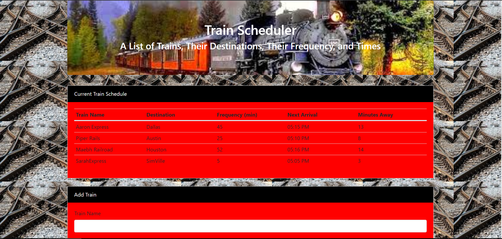

# Train Scheduler

## Description
This is a train scheduling web app that takes in the train name, its destination, the frequency of when the train arrives and in turn lets the user know when the next train will arrive and how many minutes if will be until that train arrives.
## Technologies Used
HTML, CSS, JavaScript, jQuery, Firebase, Moment
## Created By
Aaron Smith

